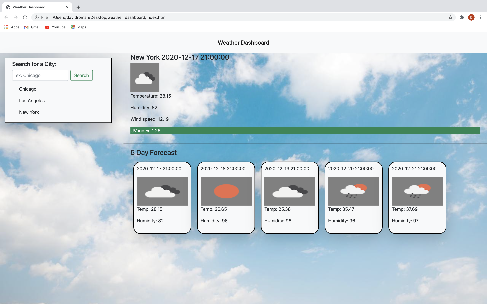

# Weather Dashboard

My challenge is to build a weather dashboard that will run in the browser and let travelers see the weather outlook for multiple cities to plan a trip accordingly. 
In order to accomplish this task, I used HTML, CSS, JAVASCRIPT, Bootstrap, and OpenWeather API. 

The user will be presented with :

Current and future conditions for that city and that city is added to the search history.

City name, the date, an icon representation of weather conditions, the temperature, the humidity, the wind speed, and the UV index.

UV index color that indicates whether the conditions are favorable, moderate, or severe.

5-day forecast that displays the date, an icon representation of weather conditions, the temperature, and the humidity.

Dashboard 
